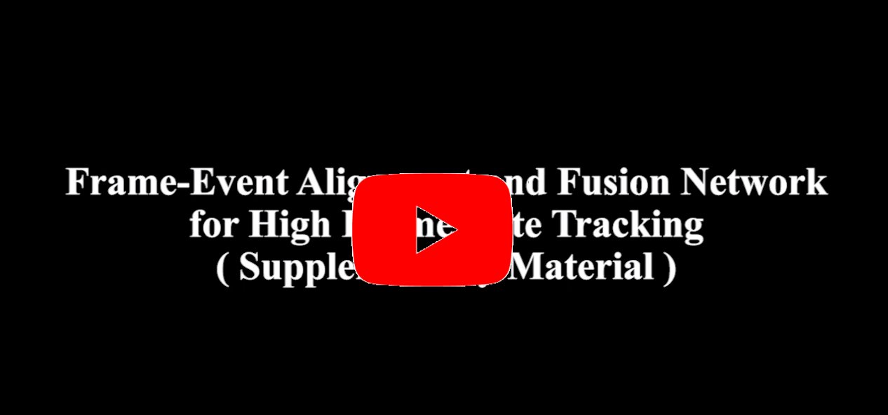
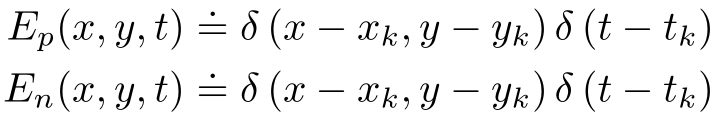

# Frame-Event Alignment and Fusion Network for High Frame Rate Tracking

<p align="center">
 <a href="https://youtu.be/W7EjOiGMiAQ">
  
 </a>
</p>

This is the code for the CVPR23 paper **Frame-Event Alignment and Fusion Network for High Frame Rate Tracking**
([PDF](https://arxiv.pdf)) by [Jiqing Zhang](https://zhangjiqing.com/), Yuanchen Wang, [Wenxi Liu](https://wenxiliu.github.io/), Meng Li, Jinpeng Bai, Baocai Yin,  and [Xin Yang](https://xinyangdut.github.io/).
 

If you use any of this code, please cite the following publication:

```bibtex
@InProceedings{Zhang_2023_CVPR,
    author    = {Zhang, Jiqing and Wang, Yuanchen and Liu, Wenxi and Li, Meng and Bai, Jinpeng and Yin, Baocai and Yang, Xin},
    title     = {Frame-Event Alignment and Fusion Network for High Frame Rate Tracking},
    booktitle = {Proceedings of the IEEE/CVF Conference on Computer Vision and Pattern Recognition (CVPR)},
    month     = {June},
    year      = {2023},
    pages     = {9781-9790}
}
```

## Abstract
Most existing RGB-based trackers target low frame rate benchmarks of around 30 frames per second. This setting restricts the tracker’s functionality in the real world, especially for fast motion. Event-based cameras as bioinspired sensors provide considerable potential for high frame rate tracking due to their high temporal resolution. However, event-based cameras cannot offer fine-grained texture information like conventional cameras. This unique complementarity motivates us to combine conventional frames and events for high frame rate object tracking under various challengingconditions. Inthispaper, we propose an end-to-end network consisting of multi-modality alignment and fusion modules to effectively combine meaningful information from both modalities at different measurement rates. The alignment module is responsible for cross-style and cross-frame-rate alignment between frame and event modalities under the guidance of the moving cues furnished by events. While the fusion module is accountable for emphasizing valuable features and suppressing noise information by the mutual complement between the two modalities. Extensive experiments show that the proposed approach outperforms state-of-the-art trackers by a significant margin in high frame rate tracking. With the FE240hz dataset, our approach achieves high frame rate tracking up to 240Hz.


<div align="center">
  <table>
    <tr>
      <td>
        
      </td>
      <td>
        
      </td>
    </tr>
    <tr>
      <td align="center">FE240hz Dataset: HDR</td>
      <td align="center">FE240hz Dataset: Severe Motion</td>
    </tr>
  </table>
</div>

<div align="center">
  <table>
    <tr>
      <td>
        
      </td>
      <td>
        
      </td>
    </tr>
    <tr>
      <td align="center">VisEvent Dataset: Rigid Object</td>
      <td align="center">VisEvent Dataset: Non-Rigid Object</td>
    </tr>
  </table>
</div>

---

## Content

This document describes the usage and installation for this repository.<br>

1. [Installation](#Installation)<br>
2. [Preparing Dataset](#Preparing-Dataset)<br>
3. [Training](#Training)<br>
4. [Evaluation](#Evaluation)<br>
5. [Acknowledgments](#Acknowledgments)<br>

---

## Installation
The code is based on [pytracking](https://github.com/visionml/pytracking) and tested on Ubuntu 20.04 with Python 3.8 and PyTorch 1.8.1.
1. We recommend using conda to build the environment:
    ```bash
    conda create -n <env_name>
    ```
2. Install the dependent packages:
    ```bash
    pip install -r requirements.txt
    ```
3. Install deformable convolution according to [EDVR](https://github.com/xinntao/EDVR):
    ```bash
    python setup.py develop
    ```

## Preparing Dataset
We evaluate AFNet on two dataset: [FE240hz](https://zhangjiqing.com/dataset/) and [VisEvent](https://github.com/wangxiao5791509/VisEvent_SOT_Benchmark). The FE240hz dataset has annotation frequencies as high as 240 Hz. With this dataset, our method can accomplish a high frame rate tracking of 240Hz. Compared with FE240hz, VisEvent provides 25Hz annotation frequency, which contains various rigid and non-rigid targets both indoors and outdoors.
1. For the FE240hz dataset, we split a sequence into multiple subsequences of length 2000 to avoid the sequence being too long. We accumulate events using this [file](https://onedrive.live.com/?authkey=%21AIqMYmemg6mUH6E&id=68BC67AE5B44298A%21154&cid=68BC67AE5B44298A).
2. For the VisEvent dataset, we  remove sequences that miss event data or have misaligned timestamps, leaving 205 sequences for training and 172 for testing.  We adopt a different event representation method for VisEvent to validate the generalization of AFNet:
 

##  Training

1. `cd ltr` and change `--workspace_dir` and `--data_dir` in ./admin/local.py. 

2. Run ``` python run_training.py  afnet afnet ``` to train our AFNet. 

##  Evaluation

1. `cd pytracking`

2. Change your local path in ./evaluation/local.py

3. run ``` python run_tracker.py dimp afnet --dataset eotb --sequence val --epochname your_checkpoint.pth.tar ``` the predicted bounding boxes are be saved in ./tracking_result.  
    - The predicted  bounding box format:  An N×4 matrix with each line representing object location [xmin, ymin, width, height] in one event frame.

##  Acknowledgments
* Thanks for the great [visionml/pytracking](https://github.com/visionml/pytracking)  module.
* Thanks for the great [EDSR](https://github.com/xinntao/EDVR)  module.